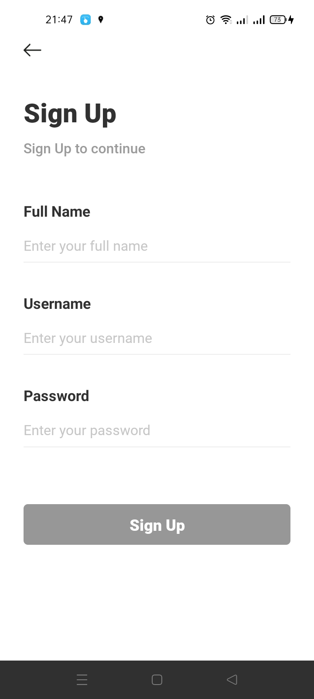
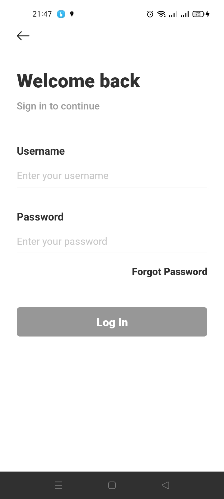
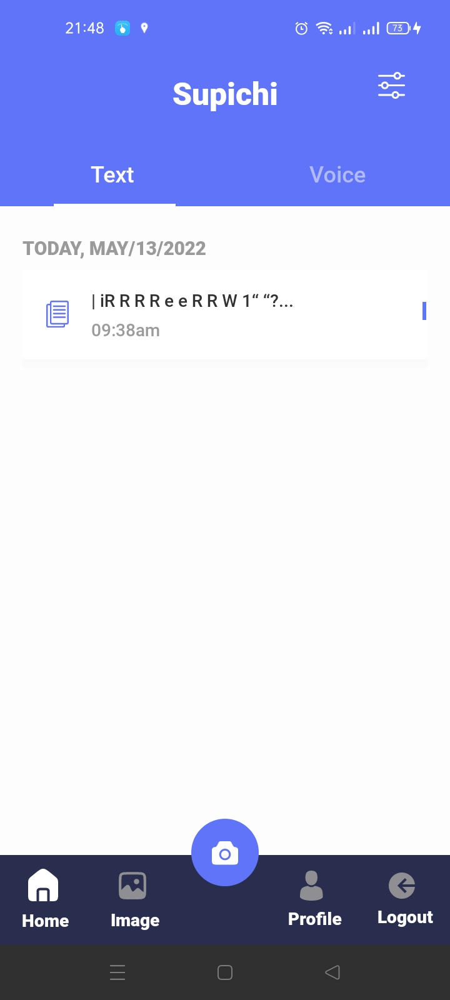
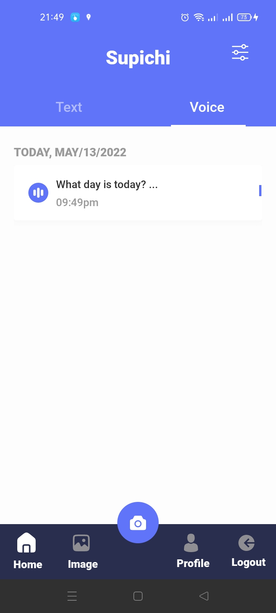
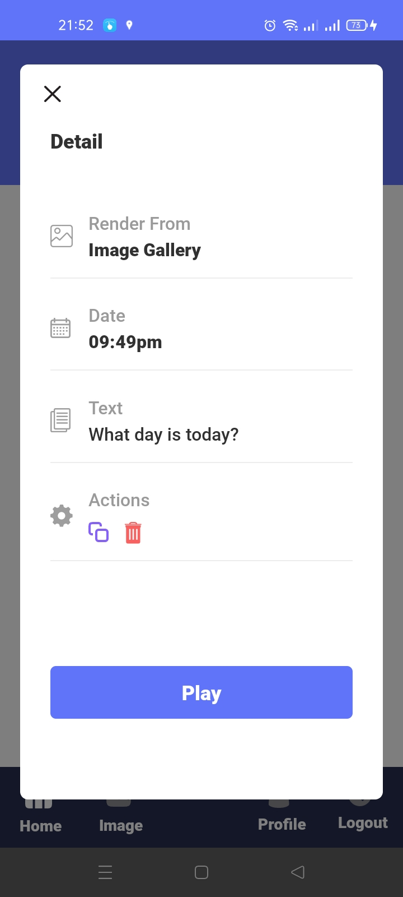

# Text To Speech App
Supichi is a text-to-speech app that's built with React Native, Typescript, Node Js, Nest Js and MySQL.

## How To Run This App ?
- Make sure you had clone this repo
- Open your terminal in this project and type npx yarn install
- If you will run the app in an iOS Simulator, please type cd ios && pod install && cd .. && npx yarn ios
- But if you will run the app in an android emulator or android physical device you can type npx yarn android

## Preview Project

### Welcome Page

### Sign Up

### Sign In

### Home Screen (Texts List)

### Home Screen (Voice List)

### Detail Page

### Profile
